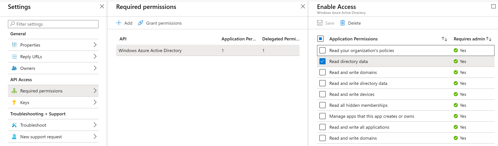
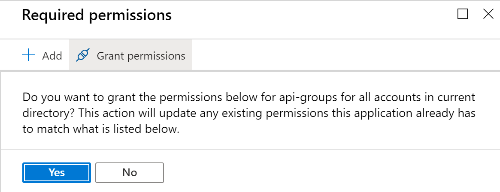
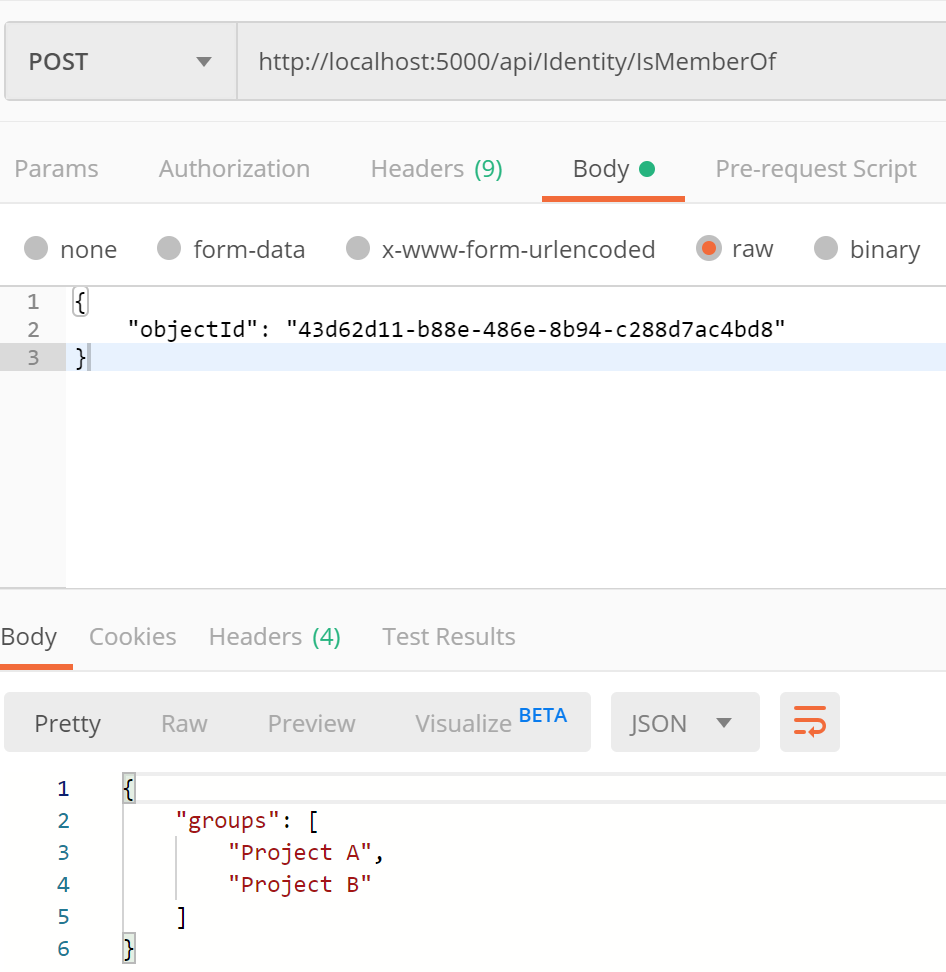
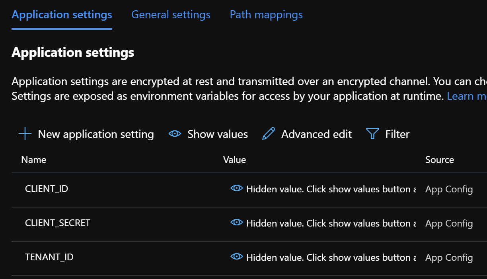
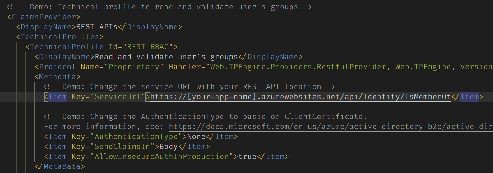

# AAD Graph Client (.Net Core) for Group Claims

This is a sample application that is used for providing group claims to tokens issued by Azure AD B2C. It is essentially a slightly modified and updated version of the API provided in the [Role-Based Access Control sample](https://github.com/azure-ad-b2c/samples/tree/master/policies/relying-party-rbac) created by the Azure B2C team.

## B2C User Configuration

In the AAD tenant that hosts your B2C enviornment, select a user account and add it to at least one group. Document the user's `Object ID`, which is found on the user's home page. This value is required for testing the API once it is configured.

## AAD Application Configuration

This sample API authenticates to your B2C AAD tenat via an applicaiton registration. You must first create an application by authenticating to the Azure Portal and switching to the Active Directory tenant hosting your B2C envioronment. Next, navigate to **Active Directory** and then select **App Registrations (legacy)**. Click the **New Application Registration** button. At the next screen, set the applicaiton type to **Web App / API** and enter a dummy value for the **Sign on URL**.

Next, document these values as they will be required for local testing and deployment:

* `Application ID` : This is found on the main page of the application registration.
* `Application Secret` : You will need to generate a secret by clicking your application, clicking **Settings** button, and navigating to **Keys**. When created, document the value and be careful never to share it.
* `Tenant ID` : This is found on the overview page for Active Directory. It will be in the format of *[some-name].onmicrosoft.com*

Finally, the application must be granted permission to read AAD data. Select the application and click the **Settings** button. Next, select **Required permissions** and check **Read Directory Data** under Application Permissions.



Finally, click the **Grant Permissions** button to enable this access in your AAD tenant.



## API Configuration: Local

The application data created in the previous section is necessary for the sample API to connect to AAD. In the `src` directory, create a new file called `appsettings.json` and populate it with the following.

> NOTE: For security purposes, the appsettings.json file is excluded from source control.

```json
{
  "Logging": {
    "LogLevel": {
      "Default": "Information",
      "Microsoft": "Warning",
      "Microsoft.Hosting.Lifetime": "Information"
    }
  },
  "AppSettings": {
    "Tenant": "[your_b2c_tenant_name].onmicrosoft.com",
    "ClientId": "[your_application_id]",
    "ClientSecret": "[your_application_secret]"
  },
  "AllowedHosts": "*"
}
```

Ensure you have the [.Net Core SDK 3.1 or higher](https://dotnet.microsoft.com/download/dotnet-core/3.1) installed on your device. From a command prompt, switch to the `src` directory and run the following command: `dotnet run`

You should now be able to invoke the API via an HTTP POST command and passing in the user's `objectId` that was documented earlier in the request body.

```bash
curl --location --request POST 'http://localhost:5000/api/Identity/IsMemberOf' \
--header 'Content-Type: text/plain' \
--data-raw '{ "objectId": "43d62d11-b88e-486e-8b94-c288d7ac4bd8" }'
```

You should see group memberships returned in the response body. For convenience, a tool such as Postman may be used to test the API locally.



## API Configuration: Azure

This API may be deployed to Azure in a variety of ways, including Docker. The only requirement is that environment variables be configured and presented to the API since the `appsettings.json` file is exluded from source control. In Azure App Service,this is done by creating entries the following entries in Application Settings:



## B2C Policy Configuration

Implement the policy changes [as shown in this sample](https://github.com/azure-ad-b2c/samples/tree/master/policies/relying-party-rbac/policy). You will need to set the URL of the sample API in the `REST-RBAC` technical profile.

> NOTE: This sample does not include authentication between your B2C instance and the sample API. This is NOT to be used in any sort of production envionrment. Mutual TLS can be configured for this scenario.

